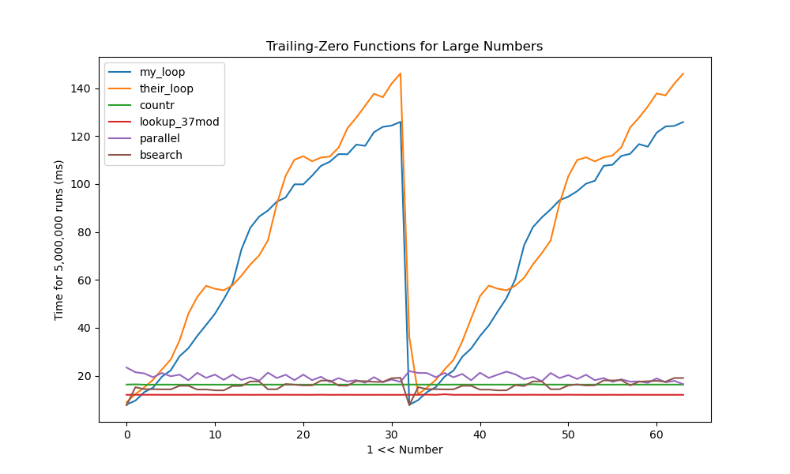
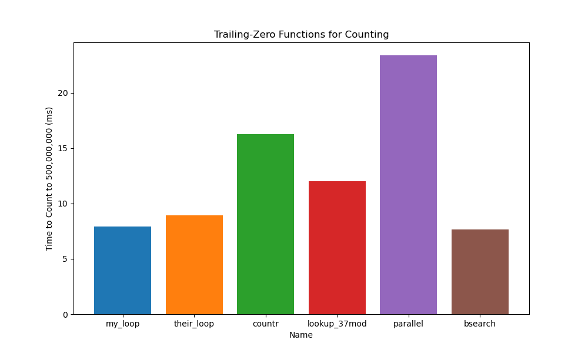

# Trailing Zeros Functions

I was trying to figure out what function would be best for computing
the number of trailing zeros of any number in my program. The
function would be used many times in the program on bitboards, so
it's crucial that it's as fast as possible. So, I wrote a C++ program to
help me pick out a function!

## What functions are there?

There are a total of six functions, however I pulled most of them from
[this bit twiddling site](https://graphics.stanford.edu/~seander/bithacks.html).
The `my_loop` function is one I made myself, and the `countr` 
function refers to C++'s standard library function called by 
`std::__countr_zero`.

## What does it do?

The `trailing.cpp` program does two things:

1. For each bit in a 64 bit, unsigned integer, the program computes how 
long it takes each function to count the number of zeros behind that bit
five million times.

2. It also computes how long it takes each function to count the number of 
zeros from one to five hundred million.

It then takes the data from these runs and puts it into `discrete.csv` and 
`range.csv`, respectively.

You can visualize this data with `display.py`, which illustrates how each 
function compares in these two trials.

## My Results




Well, the loops perform terribly at large numbers. However, they tend to 
perform better when counting since the vast majority of integers have a 1 
within the first few bits. Since bitboards aren't exactly a form of 
counting, the performance at evaluating large numbers should be 
prioritized.

That said, I'll end up using the `lookup_37mod` function since it seems to 
perform well in both situations.

## How to Use

Simply enter these commands when in the `/src/trailing` directory:

```
make
./trailing
python display.py
```